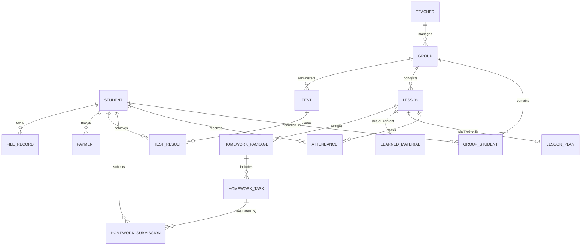

# Project Analysis & Architecture Plan: Teacher / Learning Center Management Web App

**Project Name**: Student & Learning Center Management System (Teacher OS)  
**Location**: `c:\Users\Saidislom\Desktop\Antigravity\students`  
**Date**: August 8, 2026  
**Status**: Phase 0 — Comprehensive Project Analysis & Architecture Specification  

---

## 1. Executive Summary & Repository Status

### Current Workspace State
- **Workspace Status**: Fresh / Greenfield repository.
- **Existing Files**: None (Empty directory).
- **Existing Database**: None.
- **Existing Backend/Frontend**: None.

### Key Takeaway
Since there is no legacy code or technical debt, we have an opportunity to build a **clean, modular, production-ready, type-safe, and highly performant architecture** from the ground up, perfectly aligned with the prompt's product vision and 14-phase delivery plan.

---

## 2. Product Vision & Central Design Principle

### Central Core Architecture
The central relationship driving the application is:

$$\text{Student} \longrightarrow \text{Group} \longrightarrow \text{Lesson} \longrightarrow \text{Date} \longrightarrow \text{Daily Record}$$

Every aspect of teaching—attendance, homework checking, test results, lesson planning, actual material learned, file attachments, and parent updates—must seamlessly converge into **a single Daily Lesson Workspace**.

### Primary Goal
Eliminate repetitive data entry for teachers. When a teacher selects `[Group] + [Date]`, they can perform the entire lesson workflow in one clean, unified workspace, complete the lesson, generate a tailored parent update message, and preview/share it to Telegram with one click.

---

## 3. Recommended Technology Stack & System Architecture

### Frontend Architecture
- **Framework**: **React 18 / 19 with Vite & TypeScript**
  - Instant server startup and hot module replacement (HMR).
  - Strict type checking for complex nested models (Homework packages, IELTS score breakdowns, multi-status daily records).
  - Modern Single Page Application (SPA) routing via `React Router v6`.
- **UI & Design System**:
  - **Vanilla CSS / Custom Utility Tokens + Tailwind CSS**: Clean glassmorphism, responsive desktop/tablet/mobile layouts, sleek dark/light mode accents, and micro-animations.
  - **Icons**: `Lucide React` for clear UI visual cues.
  - **Charts & Visualizations**: `Recharts` for student performance trends, attendance metrics, and group income reports.
- **State Management & Data Layer**:
  - **Zustand / React Context**: Modular global stores for Auth/Teacher Profile, Groups, Students, Daily Workspaces, Homework Library, and Reports.
  - **Local Persistence & Data Engine**: `IndexedDB` (via `Dexie.js` / custom local storage persistence wrapper) to guarantee offline-first speed, instant response, and persistence across browser reloads, coupled with clean REST/API abstractions for future cloud backend sync.

---

## 4. Comprehensive Database Schema Design

The data model is designed to preserve full historical integrity (e.g., if a student transfers between groups, their past attendance, homework submissions, test results, and payments remain tied to the historical group & lesson).



### Table Definitions & Key Entities

1. **`users / teachers`**: `id`, `full_name`, `email`, `phone`, `role` (`ADMIN` | `TEACHER`), `avatar_url`, `created_at`.
2. **`students`**: `id`, `full_name`, `phone`, `parent_name`, `parent_phone`, `enrollment_date`, `status` (`ACTIVE` | `INACTIVE` | `ARCHIVED`), `notes`, `avatar_url`, `created_at`.
3. **`groups`**: `id`, `name`, `teacher_id`, `course_subject` (e.g., IELTS, General English), `level`, `schedule_description`, `start_date`, `status` (`ACTIVE` | `ARCHIVED`), `notes`, `created_at`.
4. **`group_students`**: `id`, `group_id`, `student_id`, `joined_at`, `status` (`ACTIVE` | `LEFT`).
5. **`lessons`**: `id`, `group_id`, `date`, `status` (`PLANNED` | `COMPLETED` | `CANCELLED`), `title`, `notes`, `created_at`.
6. **`attendance`**: `id`, `lesson_id`, `student_id`, `status` (`PRESENT` | `ABSENT` | `LATE` | `EXCUSED`), `note`, `updated_at`.
7. **`homework_packages`**: `id`, `group_id`, `lesson_id`, `title`, `description`, `deadline`, `created_at`.
8. **`homework_tasks`**: `id`, `package_id`, `title`, `task_type` (`READING` | `LISTENING` | `WRITING` | `SPEAKING` | `VOCABULARY` | `GRAMMAR` | `FILE` | `LINK` | `CUSTOM`), `instructions`, `attachment_url`, `link_url`, `max_score`.
9. **`homework_submissions`**: `id`, `task_id`, `student_id`, `status` (`NOT_CHECKED` | `COMPLETED` | `MISSING` | `LATE` | `PARTIAL`), `score`, `comment`, `updated_at`.
10. **`homework_library`**: `id`, `title`, `course_subject`, `level`, `category`, `tasks_json`, `tags`, `created_at`.
11. **`tests`**: `id`, `group_id`, `title`, `date`, `category` (`IELTS_LISTENING` | `IELTS_READING` | `IELTS_WRITING` | `IELTS_SPEAKING` | `IELTS_OVERALL` | `GENERAL`), `max_score`, `created_at`.
12. **`test_results`**: `id`, `test_id`, `student_id`, `score`, `percentage`, `listening_score`, `reading_score`, `writing_score`, `speaking_score`, `comment`, `screenshot_url`, `created_at`.
13. **`lesson_plans`**: `id`, `lesson_id`, `topic`, `objectives`, `vocabulary`, `grammar`, `reading`, `listening`, `speaking`, `writing`, `activities`, `materials`, `planned_homework`, `teacher_notes`.
14. **`learned_material`**: `id`, `lesson_id`, `vocabulary`, `grammar`, `reading_passage`, `listening_activity`, `speaking_topic`, `writing_technique`, `exam_strategy`, `custom_notes`.
15. **`payments`**: `id`, `student_id`, `group_id`, `amount`, `payment_date`, `period_month`, `payment_method` (`CASH` | `CARD` | `BANK_TRANSFER`), `status` (`PAID` | `PARTIAL` | `UNPAID`), `notes`, `created_at`.
16. **`files`**: `id`, `file_name`, `file_type`, `file_size`, `url`, `student_id`, `group_id`, `lesson_id`, `test_id`, `homework_id`, `uploaded_at`.
17. **`parent_communications`**: `id`, `student_id`, `group_id`, `lesson_id`, `message_type` (`DAILY_UPDATE` | `HOMEWORK` | `TEST_RESULT` | `MONTHLY_REPORT`), `message_text`, `sent_at`, `status`.

---

## 5. Risk Assessment & Engineering Guidelines

1. **Risk: Historical Data Disruption**
   - *Issue*: Changing a student's group might orphan past attendance or test results.
   - *Mitigation*: All historical records (`attendance`, `test_results`, `homework_submissions`) store both `student_id` and `lesson_id` / `group_id` directly, ensuring historical reporting remains intact even if a student leaves a group.
2. **Risk: Complex Nested Homework Granularity**
   - *Issue*: A lesson can have multiple distinct homework tasks (e.g., Reading + Vocabulary + Essay), each evaluated independently per student.
   - *Mitigation*: Separate `homework_packages` from `homework_tasks` and `homework_submissions`, preventing flat text hacks and enabling granular per-task checking.
3. **Risk: Unwanted Automated Messaging**
   - *Issue*: Automated notifications sent without teacher verification can cause embarrassment or wrong data dispatch.
   - *Mitigation*: Strict 5-step workflow: `Generate → Preview → Edit → Confirm → Share`. No auto-sending.
4. **Risk: Credential Exposure**
   - *Issue*: Bot tokens or database keys leaking into frontend bundles.
   - *Mitigation*: Strict environment variable handling, zero hardcoded secrets, and clear abstraction interfaces for server/bot integrations.

---

## 6. Phased Implementation Roadmap

Each phase will be implemented sequentially, tested, verified, and submitted for user approval before moving to the next.

```text
PHASE 0: Analysis & Master Blueprint (CURRENT)
   │
   ▼
PHASE 1: Foundation (Vite + React + TS setup, Router, Design System, Database Engine, Shared Components)
   │
   ▼
PHASE 2: Groups & Student Management (Profiles, Enrollment, Group Schedules, Student Timelines)
   │
   ▼
PHASE 3: Attendance Engine (Daily/Weekly/Monthly, Group & Student Attendance Metrics)
   │
   ▼
PHASE 4: Payments & Tuition System (Monthly tracking, Overdue Balances, Revenue Analytics)
   │
   ▼
PHASE 5: Lessons & Daily Workspace (Central Group + Date Workspace, Lesson Plans, Learned Material)
   │
   ▼
PHASE 6: Multi-Task Homework System (Packages, Granular Task Checking, Student Statuses)
   │
   ▼
PHASE 7: Reusable Homework Library (Categorization, Search, Preview, One-Click Package Duplication)
   │
   ▼
PHASE 8: Tests & IELTS/General Scoring (Category Breakdown, Skill Analytics, Screenshots)
   │
   ▼
PHASE 9: Organized File & Screenshot Store (Metadata-tagged Document & Result Storage)
   │
   ▼
PHASE 10: Analytical Reports (Daily, Weekly, Monthly, Group & Individual PDF/CSV Exports)
   │
   ▼
PHASE 11: Parent Communication Generator (Daily Updates, Homework Summaries, Preview/Edit Flow)
   │
   ▼
PHASE 12: Telegram Integration Layer (Secure Sharing Abstraction, Telegram Webhook/Link formatting)
   │
   ▼
PHASE 13: Interactive Calendar & Reminders (Deadline Tracking, Lesson Schedule, Overdue Alerts)
   │
   ▼
PHASE 14: Final System Polish & Optimization (Accessibility, Mobile UX, Performance Audit)
```

---

## 7. Next Steps

With **Phase 0 (Analysis)** complete, we are ready to pause and request approval to begin **Phase 1: Foundation**.
